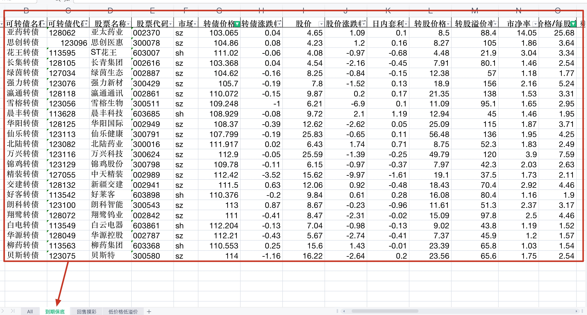
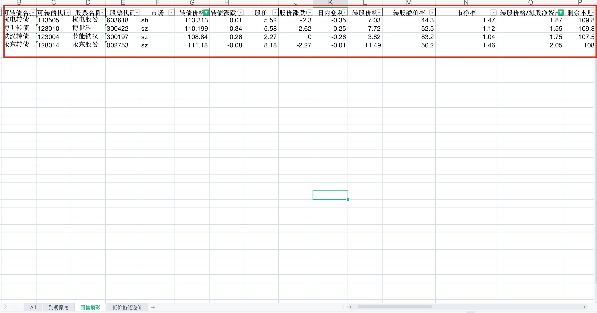
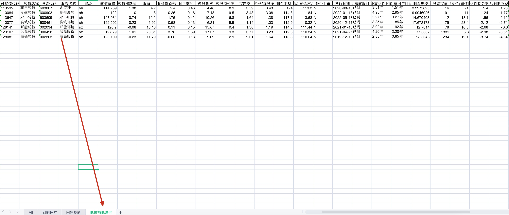

# 宁稳网(旧富投网)、集思录可转债数据

## 数据爬取

### 入手

- 直接使用请求HTMl的Response数据覆盖output.html即可

- 使用cookie登录，直接copy请求头的cookie字段值覆盖`.env`的`login_cookie`即可
 
注意!!!: 建议使用[全表](https://www.ninwin.cn/index.php?m=cb&a=cb_all&show_cb_only=Y&show_listed_only=Y)页面数据，全表页面数据丰富，但全表页面需要有账号登录，注册还要考试，挺麻烦的。为了快速运行起来，可使用[简表](https://www.ninwin.cn/index.php?m=cb&show_cb_only=Y&show_listed_only=Y)页面数据

### 数据示例

### 数据参考

可跳转：[可转债全表数据](https://www.ninwin.cn/index.php?m=cb&a=cb_all)

如图

### 数据输出

提供两种输出方式：
- excel 调用 `output_excel`
- 入库到mysql中`store_database`

## 策略

可转债四象限区分

- 一象限：高价格，高溢价率，债性弱，股性强，收益高，风险大。

- 二象限：低价格，高溢价率，债性强，股性弱，收益低，风险小，易触发「转股价下修条款」。

- 三象限：低价格，低溢价率（双低），债性强，股性强，收益高，风险小。

- 四象限：高价格，低溢价率，债性弱，容易强赎，跟正股程度高。

> 摊大饼策略集中在第二第三象限内

### 到期保底

#### 必须条件

- 到期收益率>0 — 保底
- 转债价格低于115 — 130以上卖出，100保底，去中间值
- 距离转股时间已到 — 这样正股上涨才带得动
- 转股价格/每股净资产 > 1.5 — 下修有空间
- 满足下修条件，且距离不下修承诺截止日小于一个月 — 截至时间有下修机会

#### 附加条件

- 除了科创板
- 转债剩余/市值比例 > 10 — 还债压力大，下修动力强

#### 排序

- 到期收益率降序

#### 优先

- 到期收益
- 可转债价格
- 回售时间短

#### 策略结果截图

---
### 回售摸彩

#### 必须条件

- 回售内 — 回售期内
- 转股价格/每股净资产 > 1.5 — 下修有空间
- 转债剩余/市值比例 > 10 — 还债压力大，下修动力强
- 转债价格低于115 > 保底
- 满足下修条件，且距离不下修承诺截止日小于一个月 — 截至时间有下修机会

#### 附件条件

- 到时时间少于半年 — 时间太短，没什么波动了
- 到期收益率> -10% — 这一约束意义不大，因为已经在转债价格有约束了

#### 排序

- 转债剩余/市值比例倒序排序

#### 策略结果截图

### 低价格低溢价

#### 条件

- 转股溢价< -10 — 低溢价
- 转债价格低于130 — 高于130，股性太强
- 距离转股时间—已到 — 正股上涨的话，可以及时跟上这股风
- 转股价格/每股净资产 > 1.5 — 有下修空间

#### 策略结果截图

