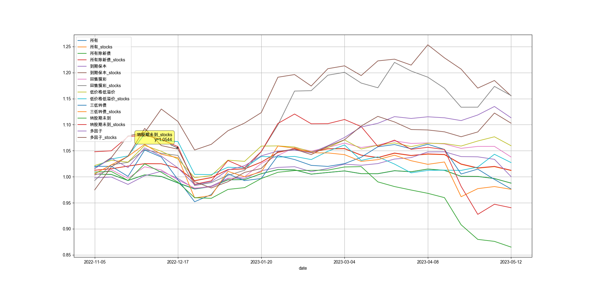
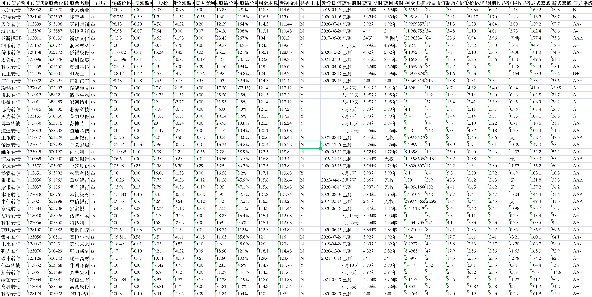
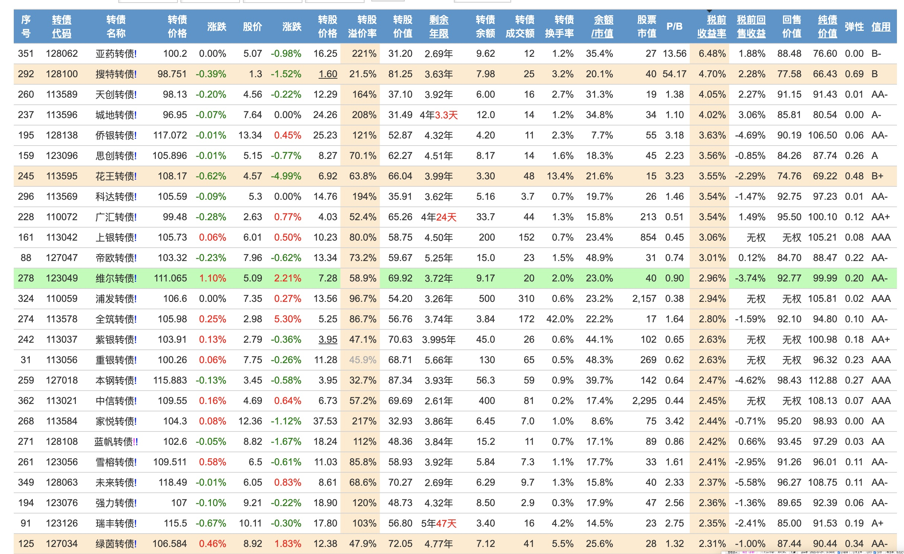
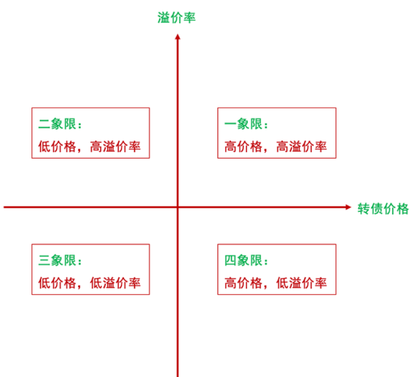
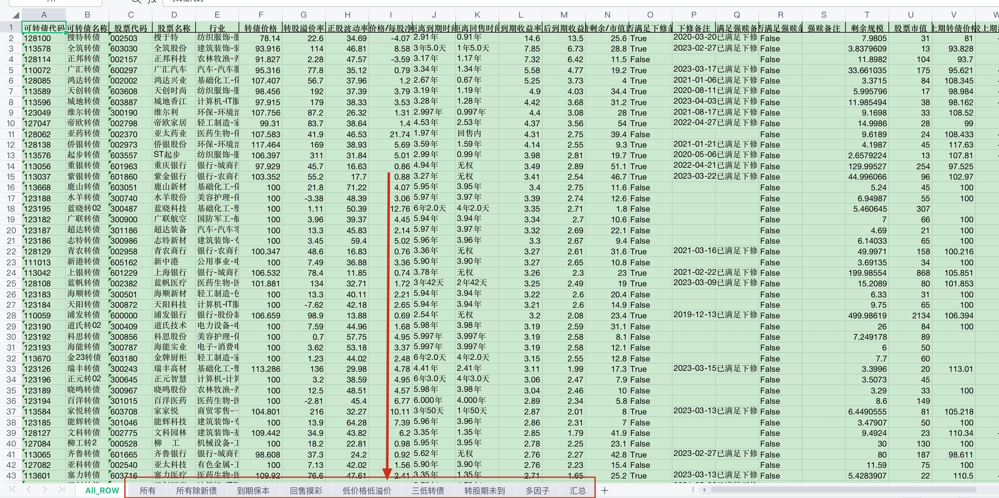

# 宁稳网(旧富投网)、集思录可转债数据&策略分析

<p align=center>
</a
>

<br>

</p>

本仓库提供如下功能：

1. 数据的获取
2. 策略筛选，输出
3. 策略回测
4. 策略可视化，log
5. ...等等未来可期

# Table of Contents

- [数据爬取](#数据爬取)
  - [安装](#安装)
  - [运行](#运行)
  - [数据参考](#数据参考)
- [策略](#策略)
  - [整体估值](#整体估值)
  - [到期保本](#到期保本)
  - [回售摸彩](#回售摸彩)
  - [低价格低溢价](#低价格低溢价)
  - [三低转债](#三低转债)
  - [转股期未到](#转股期未到)
  - [多因子](#多因子)
  - [策略截图](#策略截图)
- [多因子策略](#多因子策略)
- [ChangeLog](#ChangeLog)

## 数据爬取

### 安装

> 需要提前安装好 chromedriver 驱动（版本需要和你本地电脑 Chrome 浏览器版本一致），

1. `pip3 install -r requirements.txt`

2. 从环境参数模板（.env.example）中复制一份文件（.env）,修改本地环境变量

   > `cp .env.example .env`

   设置`login_cookie`为你的 cookie 值, 如果需要存储到数据库还要设置数据库账号,密码登
   注意!!!: 建议使用[全表](https://www.ninwin.cn/index.php?m=cb&a=cb_all&show_cb_only=Y&show_listed_only=Y)页面数据，全表页面数据丰富，但全表页面需要有账号登录，注册还要考试，挺麻烦的。为了快速运行起来，可使用[简表](https://www.ninwin.cn/index.php?m=cb&show_cb_only=Y&show_listed_only=Y)页面数据

### 运行

> `python main.py`

```bash
# 选择你执行操作即可
请输入下列序号执行操作:
             1.“输出到本地”
             2.“存到数据库”
             3.“回测”
             4.“可视化”
             5.“多因子策略回测”
         输入：
```

### 数据示例



### 数据参考

可跳转：[可转债全表数据](https://www.ninwin.cn/index.php?m=cb&a=cb_all)

如图


## 策略

详细文章可看[谈谈自己的可转债策略](./docs//%E8%B0%88%E8%B0%88%E8%87%AA%E5%B7%B1%E7%9A%84%E5%8F%AF%E8%BD%AC%E5%80%BA%E7%AD%96%E7%95%A5.md)

### 整体估值

参考: [集思录转债等权指数](https://www.jisilu.cn/data/cbnew/cb_index/)

可转债四象限区分



- 一象限：高价格，高溢价率，债性弱，股性强，收益高，风险大。

- 二象限：低价格，高溢价率，债性强，股性弱，收益低，风险小，易触发「转股价下修条款」。

- 三象限：低价格，低溢价率（双低），债性强，股性强，收益高，风险小。

- 四象限：高价格，低溢价率，债性弱，容易强赎，跟正股程度高。

> 摊大饼策略集中在第二第三象限内

### 到期保本

#### 必须条件

- 税后到期收益率 > 0 — 保本
- 距离转股时间已到 — 这样正股上涨才带得动
- 转股价格/每股净资产 > 1.5 — 下修有空间， 同时可以过滤一下垃圾袋
- 满足下修条件，且不在承诺不下修时间内 — 排除那些在截至时间内承诺不下修的可转债
  > 具体实现看代码

#### 附加条件

- 转债剩余/市值比例 > 10 — 还债压力大，下修动力强

#### 排序

- 到期收益率降序

#### 优先

- 到期收益
- 可转债价格
- 回售时间短

---

### 回售摸彩

#### 必须条件

- 回售内 — 回售期内
- 满足下修股价要求 -- 必须
- 转股价格/每股净资产 > `1 + premium_rate * 0.008` — 下修有空间
- 转债剩余/市值比例 > 5 — 还债压力大，下修动力强
- 转债价格低于 125 > 有一定的安全保底
- 满足下修条件，且距离不下修承诺截止日小于一个月 — 截至时间有下修机会
  > 具体实现看代码

#### 附件条件

- 到期时间少于半年 — 时间太短，没什么波动了
- 到期收益率> -10% — 这一约束意义不大，因为已经在转债价格有约束了
- 排序 EB 债

#### 排序

- 转债剩余/市值比例倒序排序

### 低价格低溢价

#### 条件

- 转股溢价< 10% & 转债价格低于 128 or 转股溢价< 15% & 转债价格低于 125 // 价格越高，股性越强，债性越弱
- 距离转股时间—已到 — 正股上涨的话，可以及时跟上这股风
- 转股价格/每股净资产 > 1 — 有下修空间
- 距离回售时间 -- 有权, 无强赎

> 具体实现看代码

### 三低转债

> 有助于挖掘妖债前提特质

- 无强赎
- 转债剩余余额小
- 转股溢价率小
- 正股市值小
- 溢价率 < 30 or 价格 < 130 // 有点安全垫底
- 到期时间 > 90 天

> 具体实现看代码

### 转股期未到

> 可当成次新债

- 不能转股

### 多因子

```python
"""多因子筛选
债权+股权
1. 价格
2. 溢价率
3. 剩余市值
4. 正股市值
5. 到期时间
6. 波动率
"""
```

> 具体实现看代码

### 策略截图



以上策略条件分别实现在以`filter.py`文件中

### 多因子策略

以上策略的轮动情况已经在 excel 文件中记录，并且输出到 summary.json 文件中。为了模拟实战场景，自定义更多参数，特意写了一个多因子策略回测的脚本，可以支持更多自定义功能。

多因子策略回测，根据多因子策略筛选的结果，模拟买卖情况，记录持仓，计算收益率， log，可视化等等

### ChangeLog

- 2023-05

1. 丰富多因子策略
2. 增加多因子策略回测代码

- 2023-04-15

1. 增加正股波动因子
2. 增加行业字段
3. 增加预强赎字段

- 2023-04-08

1. 重构了代码
2. 增加多因子查询

- 2023-03-25

1. 支持阶段收益计算,汇总

- 2023-03-19

1. 增加规模字段
2. 输出小规模可转债跟踪
3. 输出未转股期可转债跟踪

- 2023-03-11

1. 更新双低策略条件--放宽一些条件，详细看代码
2. 增加强赎字段
3. 整理一下目录

- 2023-01-14: 修改到期保本策略条件（去掉 115 价格限制，到期收益率改为税后到期收益率）, 低价格低溢价的 cb_to_pb 改为大于 1
- 2023-01-20: 更新回售策略的条件

  - 改 115 的限制为 125
  - 增加税后收益率 > `-10%`
  - 排除掉 EB 类债
  - cb_to_pb 改为大于`(1 + premium_rate * 0.008)`

### TODO

- 企业负债率维度
- 企业性质维度

## 最后

如果遇到感兴趣该项目,欢迎扫描下方微信二维码（anchor_data）,欢迎交流


